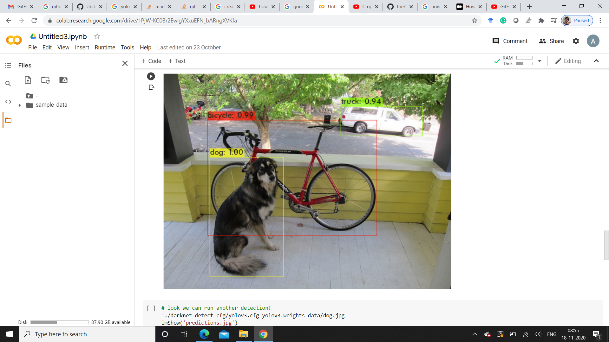

# Underwaterobjectdetection
Due to the importance of underwater exploration in the development and utilization of marine resources, an autonomous underwater operation is critical to avoid
the dangerous high-pressure deep-sea environment. For independent underwater operation, intelligent computer vision is the most critical technology. Object
detection and recognition techniques have been commonly used on video analysis for the assessment of animal populations. In recent years, with underwater cameras,
a few research studies have been investigated for fish detection, recognition, tracking, and counting. In contrast to the conventional fishery monitoring
approaches, including mark-recapture techniques and gill netting, the underwater image-based methods have advantages such as accurate species
counting due to long term observation and environmental sustainability without disturbing their habitat. However, the low-light and high-noise
scenarios pose several significant challenges for underwater video analysis. Firstly, low illumination environments cause relatively low contrast
background, which can confuse the traditional interest point detectors and produce weak descriptors. In an underwater environment, weak illumination 
and low-quality image enhancement are necessary for underwater vision as a preprocessing procedure. In this project, a combination
of bm3d algorithm and shades of the gray method is applied to achieve the enhancement of underwater vision, and then a convolutional neural
network (CNN) (Convolutional Neural Network) method for solving the weakly illuminated problem for underwater images will be used to train
the mapping relationship to obtain the illumination map. After the image processing, a deep learning You only look once (YOLO) model will
be used to perform the underwater detection and classification; according to the characteristics of underwater vision, two improved schemes are
applied to modify the deep convolutional neural network (CNN) structure. I will have two objects, fish and starfish that I will identify, and
all other items will act like an attacker. Even though the ocean plays a very foundation role in human life, we have a limited ability to explore
the underwater world for a long time in history. Today’s technologies and materials allow us to explore the ocean deep and observe the undersea environment
continuously. Undersea exploration can help us to understand marine ecosystems and environmental changes better.

Result of Yolo model applied on normal image-

